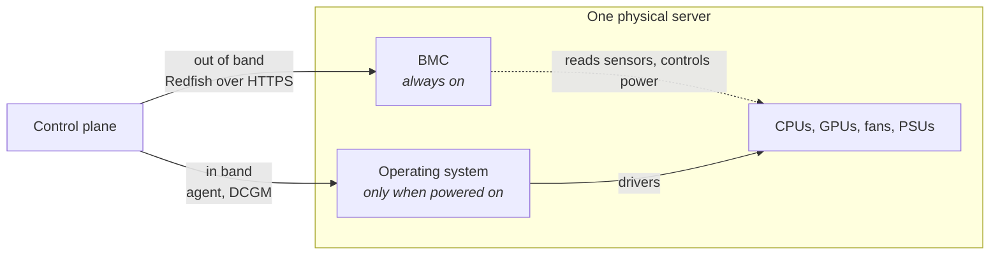

# 1. The domain primer

Everything you need to read the rest. Nothing beyond that.

## 1.1 A server has two brains

Every server built for a datacenter contains a second, tiny computer soldered
onto the motherboard called a **BMC**, or baseboard management controller. It
has its own processor, its own memory, its own network port, and its own power
supply path. It runs whenever the machine has AC power, including when the
server itself is switched off.

Its job is to let you manage a machine you cannot physically touch. Power it on,
read its temperature, see what hardware is installed, mount an install image.



**Out of band** means talking to the BMC. It works when the server is off, and
it sees physical facts: is there power, what is the inlet temperature, which
cards are in which slots, what is the serial number. It cannot see software at
all. It has no idea what operating system is installed or what is running.

**In band** means talking to software on the server's own operating system. It
sees everything about the software and gives detailed per GPU telemetry. It goes
completely silent when the machine is off, or when the OS has hung.

**The two can contradict each other, and that is often the most useful signal
you get.** A GPU can be physically present in the slot, reported perfectly by
the BMC, and simultaneously invisible to the driver. Neither view is wrong. The
disagreement is the diagnosis.

## 1.2 Redfish

**Redfish** is the DMTF standard REST API that BMCs speak. HTTPS and JSON. It
replaced IPMI, a binary protocol from 1998 that was insecure and inconsistent.

Resources are JSON documents at URIs, organised into a tree:

```
/redfish/v1                      service root
├── /Systems/{id}                the logical computer
│   ├── Boot                     boot source override
│   ├── Status                   {State, Health}
│   ├── /Processors/{id}         CPUs, and GPUs appear here too
│   └── Actions/ComputerSystem.Reset
├── /Chassis/{id}                the physical box
│   ├── /Sensors/{id}            temperature, voltage, power
│   └── /PCIeDevices/{id}        where GPUs also appear
├── /Managers/{id}               the BMC describing itself
└── /TaskService/Tasks/{id}      long running operations
```

Four behaviours matter more than the rest, because they are where real
provisioning code has bugs.

**Power is an action, not a field.** You `POST` to
`/Systems/1/Actions/ComputerSystem.Reset` with `{"ResetType": "On"}`. You do not
set a property. And power does not flip instantly: `PowerState` passes through
`PoweringOn` before reaching `On`. Code that assumes it is instant has a bug.

**Actions are not idempotent.** Sending `On` to a machine already powering on
may error or may cause a second transition. So every operation is written check
then act: read the state, return early if already correct, otherwise act.

**Long operations return a Task.** You get `202 Accepted` and a `Location`
header pointing at a task resource, then you poll it. Tasks that stick at 50%
forever, or report success when nothing happened, are a documented and common
failure class.

**Features are optional and often licensed.** This is the single most surprising
thing about Redfish. Metal3's documentation warns that advanced features "may
require buying an additional license" [1]. Dell's iDRAC9 Express tier includes
Redfish but excludes virtual media entirely [2]. Two vendors can both be
compliant and expose completely different capabilities.

## 1.3 The GPU software stack

A GPU is useless without a stack of software, and each layer can be wrong
independently.

| Layer | What it is | How it breaks |
|---|---|---|
| Firmware (VBIOS) | On the card itself | Rarely, but bricks it |
| Kernel driver | `nvidia.ko`, talks to the hardware | Version mismatch, fails to load, loses the device |
| CUDA runtime | The compute API | Version incompatible with the driver |
| NCCL | Multi GPU collective communication | Misconfigured, or slow because of a bad link |
| DCGM | Telemetry and diagnostics daemon | Reports stale data, or stops |

A common real failure is that the driver loads fine, the card is present in
PCIe, and `nvidia-smi` still cannot see it. Every layer says yes except the one
that matters.

## 1.4 NVLink domains, and why placement is hard

Inside a server, GPUs are connected to each other by **NVLink**, a very high
bandwidth interconnect. Eight GPUs in one box form one **NVLink domain**.

Between servers you have ordinary networking, which is an order of magnitude
slower.

This single fact drives everything about placement:

> A model must fit inside one NVLink domain, because splitting it across servers
> means paying a network hop for every token generated.

So an 8 GPU model needs 8 free GPUs **on one machine**. Eight free GPUs spread
over four machines is worth nothing to it. That is the entire source of the
fragmentation problem in chapter 5.

## 1.5 DCGM, the telemetry you actually consume

**DCGM** is NVIDIA's data center GPU manager. It runs a daemon called
`nv-hostengine` and exposes hundreds of fields. `dcgm-exporter` publishes them in
Prometheus format, and this is what essentially every GPU fleet in the world
scrapes [3].

The fields that matter for health and occupancy:

| Field | Carries |
|---|---|
| `DCGM_FI_DEV_FB_USED`, `..._FB_FREE` | Framebuffer memory. **How you observe what is running** |
| `DCGM_FI_DEV_GPU_UTIL` | Utilisation percentage |
| `DCGM_FI_DEV_GPU_TEMP`, `..._POWER_USAGE` | Thermal and power |
| `DCGM_FI_DEV_ECC_SBE_VOL_TOTAL` | Correctable memory errors, cumulative |
| `DCGM_FI_DEV_ECC_DBE_VOL_TOTAL` | Uncorrectable memory errors |
| `DCGM_FI_DEV_XID_ERRORS` | The last error code the driver raised |
| `DCGM_FI_DEV_ROW_REMAP_PENDING`, `..._FAILURE` | Memory repair state |
| `DCGM_FI_DEV_CLOCK_THROTTLE_REASONS` | Bitmask: thermal, power brake, sync boost |
| `DCGM_FI_DEV_PCIE_LINK_WIDTH`, `..._GEN` | Link width and generation |

Note what is missing from that list: **there is no field for "what is running on
this GPU"**. Hardware does not know what your scheduler decided. You infer
occupancy from framebuffer and utilisation, or you do not know it at all.

---

**References**

1. Metal3 supported hardware. https://book.metal3.io/bmo/supported_hardware
2. iDRAC Express versus Enterprise feature comparison.
   https://serverdepotus.com/blogs/news/what-idrac-enterprise-actually-unlocks
3. DCGM Exporter metrics reference.
   https://docs.nvidia.com/datacenter/dcgm/latest/reference/dcgm-exporter-metrics.html
