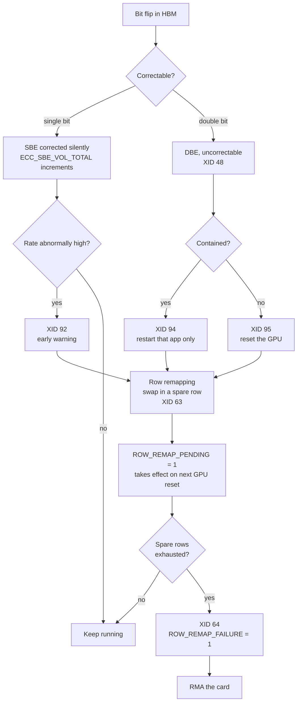

# 2. How GPUs actually fail

The mechanics, in enough depth to tell a dead card from a bug in someone's
Python.

## 2.1 XID codes

When something goes wrong with a GPU, the NVIDIA driver logs an **XID**, a
numeric error code. They appear in `dmesg`, in `nvidia-smi -q`, and in DCGM as
`DCGM_FI_DEV_XID_ERRORS`.

There are dozens. The critical insight is that **they are not all hardware
faults, and treating them the same way is expensive in both directions** [1].

| XID | Official meaning | Real cause | Correct response |
|---|---|---|---|
| **13** | Graphics Engine Exception | Application bug. "An out-of-bounds error where the user has walked past the end of an array" | **Nothing.** Fix the app |
| **31** | GPU memory page fault | Application bug. Illegal address via the MMU | **Nothing.** Fix the app |
| **48** | Double bit ECC error | Genuine uncorrectable hardware error | Reset. Replace if it recurs |
| **63** | Memory remapping event | The repair mechanism **working** | Note it. Watch for patterns |
| **64** | Memory remapping failure | Repair mechanism exhausted | Replace the card |
| **74** | NVLink error | Link or remote device failure | Investigate the link |
| **79** | GPU fell off the bus | PCIe link hardware failure | Replace the card |
| **92** | High single bit ECC rate | Memory degrading, still correcting | Early warning |
| **94** | Contained memory error | Uncorrectable, isolated to one app | Restart **that app only** |
| **95** | Uncontained memory error | Uncorrectable, affects everything | Reset the **whole GPU** |

Three pairs are worth memorising because getting them backwards is costly.

**13 and 31 versus everything else.** These are user code walking off the end of
an array. NVIDIA's guidance is to run the application under `cuda-gdb` or
Compute Sanitizer. A fleet that quarantines on XID 13 destroys working hardware
because someone shipped a bad kernel.

**63 versus 64.** 63 means the card noticed failing memory and successfully
swapped in a spare row. That is the hardware protecting itself. 64 means it
tried and could not. One is a log line, the other is an RMA.

**94 versus 95.** Both are uncorrectable memory errors. 94 is *contained*, so
NVIDIA states "the impact will be limited to the applications that encounter the
error. All other workloads will continue running unaffected" [2]. 95 is
uncontained and the whole GPU must be reset. On an inference fleet that is the
difference between restarting one model and losing a server's worth of capacity.

## 2.2 ECC and the memory repair lifecycle

GPU memory carries error correcting codes. The full lifecycle from a flipped bit
to a replaced card:

**Row remapping** replaces a degrading memory row with a spare one held in
reserve. It happens in hardware, persists for the life of the card, and takes
effect at the next GPU reset. It replaced the older *page retirement* mechanism
from before Ampere, and the improvements are concrete [3]: up to 512 remappings
versus a previous maximum of 64 retirements, no software visible holes in the
address space, and only a GPU reset rather than a driver reload.

Ampere and later also do not require a GPU reset when a *contained* memory error
occurs, which is why the 94 versus 95 distinction exists at all.

## 2.3 The only published numeric thresholds in the domain

Almost nothing in GPU health has a documented number. Row remapping is the
exception, and NVIDIA states the failure conditions precisely [4]. A remap
failure is declared when any of these is true:

1. **Eight remaps in one bank.** "A remapping attempt for an uncorrectable
   memory error on a bank that already has eight uncorrectable error rows
   remapped."
2. **A duplicate row.** "A remapping attempt for an uncorrectable memory error
   on a row that was already remapped." This can happen with far fewer than
   eight total remaps.
3. **512 total.** "After 512 total remappings for an uncorrectable memory error
   have occurred."

The RMA qualification rule is then simply that "the row-remapping failure flag
is set and validated by the field diagnostic."

Two operationally useful details. The failure flag is readable **both in band
via NVML and out of band via SMBPBI**, which makes it one of the few GPU health
facts visible from the BMC. And on Blackwell a third remap attempt triggers HBM
channel repair if spare channels exist, so the hardware gets one more chance
before the flag sets.

## 2.4 Faults with no error code

The dangerous ones raise nothing at all.

**PCIe link downgrade.** A card negotiates x8 instead of x16, or Gen1 instead of
Gen5. Nothing errors. The GPU is healthy, present, passes every check, and moves
weights at a fraction of the expected rate. Visible only if something explicitly
compares `DCGM_FI_DEV_PCIE_LINK_WIDTH` and `..._GEN` against what the card
should negotiate. Crusoe validates this explicitly during burn-in [5].

**Thermal throttling.** The card clocks down to stay within its envelope.
Utilisation still reads high while throughput falls. Often a symptom of a
cooling fault elsewhere in the chassis rather than a GPU fault, so the correct
response is to investigate the host, not retire the card. Meta observed a
diurnal 1 to 2% throughput swing across their whole cluster purely from
time of day temperature effects on GPU clock scaling [6].

**Stragglers.** A GPU that works correctly and runs slightly slow. Meta built
dedicated tooling for this and their framing is stark [6]:

> "even a single straggler can slow down thousands of other GPUs"

**Silent data corruption.** Computation returns wrong answers with no error
anywhere. Bit flips from radiation or marginal hardware produce plausible
numbers rather than crashes, so ECC never fires and nothing alarms [7]. Meta
documented six confirmed instances during the 54 day Llama 3 run [6].

These four are why passive monitoring is not enough, and why operators run
active performance and stress tests rather than just watching counters.

---

**References**

1. NVIDIA XID error catalogue.
   https://docs.nvidia.com/deploy/xid-errors/analyzing-xid-catalog.html
2. Error containment, NVIDIA GPU Memory Error Management.
   https://docs.nvidia.com/deploy/a100-gpu-mem-error-mgmt/error-containment.html
3. Row remapping, NVIDIA.
   https://docs.nvidia.com/deploy/a100-gpu-mem-error-mgmt/row-remapping.html
4. RMA policy thresholds for row remapping, NVIDIA.
   https://docs.nvidia.com/deploy/a100-gpu-mem-error-mgmt/rma-policy-thresholds-for-row-remapping.html
5. Crusoe, how we burn-in test every node.
   https://www.crusoe.ai/resources/blog/how-crusoe-burn-in-tests-every-node-before-it-reaches-you
6. The Llama 3 Herd of Models, Meta, section 3.3.4.
   https://arxiv.org/abs/2407.21783
7. Exploring silent data corruption as a reliability challenge in LLM training.
   https://arxiv.org/pdf/2604.00726
