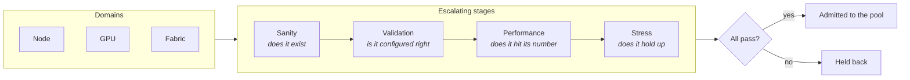

# 4. How operators handle it today

Short chapter. Two operators have published their practice in enough detail to
copy.

## 4.1 Crusoe's burn-in gate

No server holds customer work until it passes burn-in. **Up to 30 validation
tests on every node** [1], organised on two axes.

What each stage actually does:

| Stage | Purpose | Examples |
|---|---|---|
| **Sanity** | Rapid triage | Boot verification, PCIe enumeration, device presence, registry connectivity |
| **Validation** | Configuration correctness | ECC memory state, PCIe link width and speed, power delivery specs |
| **Performance** | Baseline benchmarking | DCGM diagnostics levels 1 to 4, HPL, throughput baselines |
| **Stress** | Expose marginal hardware | Sustained load, and pulsed power testing that "ramps load up and down 20 times" |

The stress stage is where the interesting failures live. Crusoe distinguishes
"hard failures", where something does not initialise, from "soft failures" that
only appear under sustained thermal and electrical stress. A card that passes
every static check and fails after twenty minutes at full power is invisible to
anything cheaper.

Fabric domain tests cover NVLink bandwidth, GPU peer to peer, multi node RDMA,
and NCCL collective operations.

**The sentence that defines this project's core loop:**

> "When we discover a new failure mode in production, we write a test that would
> have caught it and add it to burn-in."

That is a catalogue driving a validation gate, maintained by production
experience. It is precisely the structure of `catalogue/` and the `detected_by`
field in our schema.

## 4.2 Nebius, and the layered check model

Nebius describes a similar structure with more layers [2]: on site factory
tests, node deployment tests, virtual platform tests, pre-provisioning cluster
tests, then **passive and active health checks** in service.

The passive versus active split matters. Passive means watching counters that
arrive anyway. Active means periodically running something to provoke a
response. Chapter 2 explained why passive alone is insufficient: a PCIe link
downgrade raises no counter, and a straggler looks healthy on every metric
except throughput.

## 4.3 ByteDance's detection hierarchy

ByteRobust splits checks by when they run [3].

**Real time checks**, running continuously: network monitoring covering NIC,
switches and packet loss, GPU inspection via the DCGM service including PCIe
bandwidth and temperature, and host monitoring of kernel events and file system
status.

**Stop time diagnostics**, running when a job has already failed: NVIDIA
Extended Utility Diagnostics, NCCL communication tests, bit-wise alignment
verification, and dual phase replay testing specifically to catch silent data
corruption.

The economics are the lesson. Cheap continuous checks resolved 32.52% of all
failures by direct eviction. Expensive replay testing was needed for 1.23%. Put
the cheap check first and reserve the expensive one for what survives it.

## 4.4 What to copy

Three things transfer directly into this project.

1. **Admission is a gate, not a status.** A host is not available because
   nothing is wrong with it. It is available because it passed something.
2. **Tests escalate in cost.** Sanity before validation before performance
   before stress, and stop at the first failure.
3. **The catalogue feeds the gate.** Every fault worth cataloguing should name
   the test class that would catch it, and any fault with no such test is a
   documented hole in the gate.

---

**References**

1. Crusoe, how we burn-in test every node.
   https://www.crusoe.ai/resources/blog/how-crusoe-burn-in-tests-every-node-before-it-reaches-you
2. Nebius review, ClusterMAX. https://www.clustermax.ai/cloudreview/nebius
3. Robust LLM Training Infrastructure at ByteDance, SOSP '25.
   https://arxiv.org/abs/2509.16293
