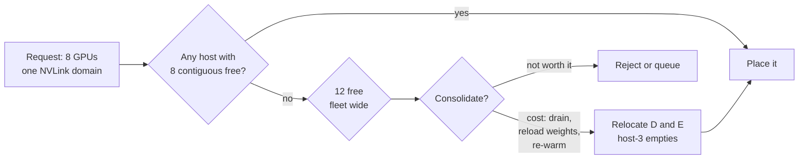

# 5. The other half: utilisation

Health keeps the fleet working. Utilisation decides whether the money spent on
it is wasted. This is the weaker evidenced half of the project and this chapter
says why.

## 5.1 GPUs are expensive and idle

Reported GPU utilisation rates in production clusters run "from 25% to below
50%" [1]. Fragmented serverless inference clusters report mean GPU memory
utilisation around **43%**, with 38% of samples sitting in the 10 to 30% range
[2].

For the most expensive hardware in the building, that is the whole problem in
one number.

## 5.2 What fragmentation actually is

Chapter 1 established the constraint: a model must fit inside one NVLink domain,
so it needs N free GPUs **on a single machine**.

Now run a fleet for a few weeks with models arriving and leaving.

```
host-1  [A][A][B][B][B][B][ ][ ]      2 free
host-2  [C][C][C][C][ ][ ][ ][ ]      4 free
host-3  [D][D][ ][ ][ ][ ][E][E]      4 free
host-4  [F][F][F][F][F][F][ ][ ]      2 free
                                     12 free in total
```

A request arrives for an 8 GPU model. **You have 12 free GPUs and you cannot
place it.** No single host has 8 contiguous free. The capacity exists, is paid
for, is powered, and is unsellable.

**Defragmentation** fixes it by moving things. Shift `D` onto host-1's two free
slots and `E` onto host-4's, and host-3 empties completely. But every move
drains a live deployment, reloads tens of gigabytes of weights, and re-warms it.



So the decision is never "can this be consolidated". It is **"is this
consolidation worth its disruption"**, and that is a live, stateful, cost aware
judgement made against a fleet that is simultaneously degrading.

## 5.3 The research, and the caveat

The canonical paper is Alibaba and HKUST's *Beware of Fragmentation* [1]. Their
finding from Alibaba production traces:

> "allocating partial GPUs can result in severe GPU fragmentation in large
> clusters, leaving hundreds of GPUs unable to be allocated"

They propose Fragmentation Gradient Descent, packing tasks to minimise
fragmentation growth rather than optimising a classic bin packing objective.
Evaluated on more than 1,200 nodes and 6,200 GPUs, FGD **reduced unallocated
GPUs by up to 49%, freeing 290 GPUs for use**.

Recent work separates two kinds [3]. **Node fragmentation**, where free GPUs are
scattered across machines so a large job cannot be placed. **GPU fragmentation**,
where individual cards are partly used by smaller tasks.

**Here is the caveat that matters.** Almost all of this literature studies
*fractional* GPU sharing, several tasks on one card, which is what makes their
formulation "beyond the classic bin packing". This project models **whole GPU
allocation bounded by an NVLink domain**, which is the node fragmentation case
only, and a simpler one.

So the papers prove fragmentation is real and costly. They do **not** prove our
specific flavour is severe. That remains the least evidenced claim in the
project, and chapter 7 treats it as a risk rather than a foundation.

## 5.4 The find that changes what we build

Alibaba has open sourced their production cluster traces [4]. Four GPU datasets:

| Trace | Scale | Period |
|---|---|---|
| `cluster-trace-gpu-v2020` | 6,500 GPUs, ~1,800 machines | 2 months |
| `cluster-trace-gpu-v2023` | 6,200 GPUs, ~1,200 machines, heterogeneous | |
| `cluster-trace-gpu-v2025` | **20,000+ inference instances across 150+ services** | |
| `cluster-trace-gpu-v2026` | **155,410 GPUs across 37,707 servers** | 6 months |

The 2025 trace is inference serving specifically, which is exactly this
project's workload model. The 2026 trace is enormous.

This matters more than it first appears. The obvious criticism of a simulated
fleet is "your workload is made up". Driving arrivals and departures from real
Alibaba production traces answers that completely, and it costs a download.

**It also means synthesising workload generators is wasted effort.** Use the
traces.

Note what the traces contain and what they do not: scheduling and workload data,
resource requests and utilisation, job characteristics. They do **not** appear to
carry hardware failure or health information. Which is chapter 6's whole point.

---

**References**

1. Beware of Fragmentation: Scheduling GPU-Sharing Workloads with Fragmentation
   Gradient Descent. Weng et al., USENIX ATC '23, HKUST and Alibaba.
   https://www.usenix.org/system/files/atc23-weng.pdf
   Mirror: https://www.cse.ust.hk/~weiwa/papers/fgd-atc23.pdf
2. FlexPipe, on fragmented serverless inference clusters.
   https://arxiv.org/pdf/2510.11938
3. Reducing fragmentation and starvation in GPU clusters through dynamic
   multi-objective scheduling. https://arxiv.org/pdf/2512.10980
4. Alibaba cluster traces. https://github.com/alibaba/clusterdata
